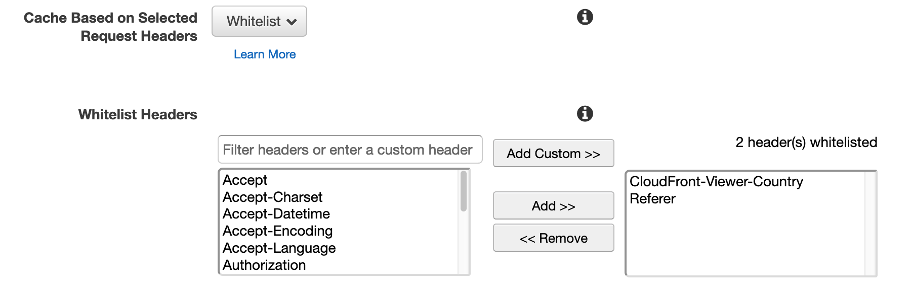

# CDN Geolocation  

Server that determines your physical location by looking at headers sent from various hosting providers and content delivery networks (CDNs).

Try it with:
[AWS CloudFront](https://aws-geo.redirect2.me/)
| [Cloudflare](https://cf-geo.redirect2.me/)
| [Fastly](https://cdn-geo.global.ssl.fastly.net/)
| [Google AppEngine](https://ae-geo.redirect2.me/)

Also see a more detailed [comparison of geolocation providers](https://resolve.rs/ip/geolocation.html)

## How it works

This application is just a simple app that shows various HTTP header values.

## Contributions

Contributions are welcome!  If you know of any other similar CDNs/services, let me know & I will add them in!

## API

There is a simple JSON/JSONP API that is free for light, non-commercial use.  This is such a trivial application that you should run your own copy (or make your own  version) for anything serious.  Both AppEngine and Cloudflare have generous free plans (which is what I'm using).

Send a `callback` parameter to get JSONP instead of JSON.

- [`/api/aws.json`](https://aws-geo.redirect2.me/api/aws.json)
- [`/api/cloudflare.json`](https://cf-geo.redirect2.me/api/cloudflare.json)
- [`/api/fastly.json`](https://cdn-geo.global.ssl.fastly.net/api/fastly.json)
- [`/api/appengine.json`](https://ae-geo.redirect2.me/api/appengine.json)

## License

[GNU Affero General Public License v3.0](LICENSE.txt)

## Credits

* togo `go run github.com/flazz/togo --pkg=main --name=faviconIco --input=assets/favicon.ico`

## Provider Setup

The real functionality is from the providers.  Here are links and tips on how to set them up.

### [AWS CloudFront](https://aws.amazon.com/cloudfront/)

[Official documentation](https://docs.aws.amazon.com/AmazonCloudFront/latest/DeveloperGuide/RequestAndResponseBehaviorCustomOrigin.html#request-custom-headers-behavior)

In Behaviors, make sure you have whitelisted the `CloudFront-Viewer-Country` header:

### [Cloudflare](https://www.cloudflare.com/)

[Official documentation](https://support.cloudflare.com/hc/en-us/articles/200168236-Configuring-Cloudflare-IP-Geolocation)

Very easy to setup: just make sure you have enabled the CloudFlare proxy in your Cloudflare DNS settings.  The little cloud has to be orange:

### [Fastly](https://www.fastly.com/)

[Official documentation](https://developer.fastly.com/reference/vcl/variables/geolocation/)

You need to configure each header.

Fastly's free tier only allows http for custom domains.  If you need https, you either have to pay or use the Fastly domain `.global.ssl.fastly.net`.

<!-- LATER: example VCL -->

### [Google AppEngine](https://cloud.google.com/appengine)

[Official documentation](https://cloud.google.com/appengine/docs/standard/go/reference/request-response-headers)

No special setup required, but your app has to be running on Google AppEngine.